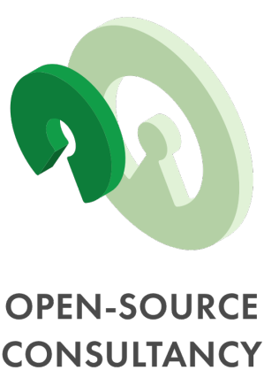
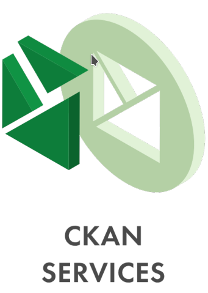
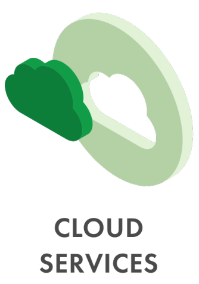
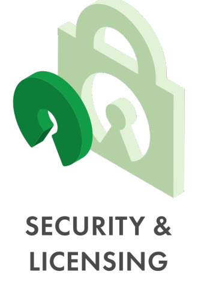
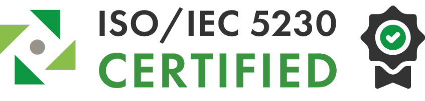

> **This repository is still in progress..**
### Hello 👋, here you can find more about:

Keitaro is a company where people grow and work with each other. Our collaborations with global organizations provide first-class open-source solutions that make a difference to the community and have a positive social impact. We are Linux and Open-source software consultancy company with strong focus in bleeding edge technologies, managed services and develops solutions empowering governments, NGOs, and enterprises around the world. Keitaro provides consulting services across leading open-source technologies. Our core services include:
 

&emsp;&emsp;&emsp;&emsp;&emsp;&emsp;

## Why Keitaro?
✅ We’re built on open-source standards and technologies.  
✅ An experienced and empowered open-source team.  
✅ Utilizing next-generation technologies.  
✅ Actively contributing to open-source projects and the wider community.  
✅ Starting from April 2021, we are ISO/IEC 5230 certified. This ensures that the solutions we create follow the OpenChain standard and that Keitaro`s practices and procedures are reliable and ompliant with accepted industry standards.   

## Products:
- **Open-source**  
Keitaro provides consulting services across leading open-source technologies, utilizing various models that follow our clients through every step of the way. We design and develop open-source solutions to empower companies, nonprofit organizations and governments right across the world. 
We’re passionate about open-source technologies and they form an essential part of our growing business. Utilizing open-source solutions can lead to a wide variety of benefits for your company including improved costs, greater flexibility, security and accountability – which is what motivates us to keep innovating.

-

## Services:

### Technologies we use:

- 🌱 Our team is around x people and we are still growing.
- 📫 How to reach us: 
- 😄 Pronouns: ...
- ⚡ Fun fact: ...
- Offices:

