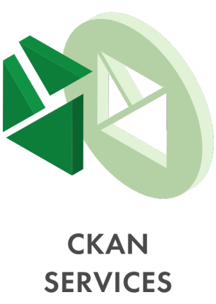

> **This repository is still in progress..**
### Hello 👋, here you can find more about

Keitaro is a company where people grow and work with each other. Our collaborations with global organizations provide first-class open-source solutions that make a difference to the community and have a positive social impact. We are Linux and Open-source software consultancy company with strong focus in bleeding edge technologies, managed services and develops solutions empowering governments, NGOs, and enterprises around the world. Keitaro provides consulting services across leading open-source technologies. Our core services include:
 

&emsp;&emsp;&emsp;&emsp;&emsp;&emsp;

At Keitaro, you will not be treated as just another account. Unlike some of the larger solution providers, we are small enough to really focus on our customers. But rest assured, we’ve got the resources and capabilities to deliver. Our customers choose Keitaro because they know we will go the extra mile, providing superior services and consistently delivering solutions on time and on budget -- ensuring their total satisfaction.

## Company's experience and structure
We are proud of our proficiency in providing solutions, flexible technology, and quick innovation. Our international team, based in Sweden, North Macedonia, the United Kingdom, Germany and the United States provides outstanding solutions. It is composed of committed and experienced professionals who work together with the goal of improving the world with technology. We believe in teamwork, but also in the strength of the individual. Each member of our team provides their personal mark, which builds a sustainable working environment.  
As a flat organization, our company is structured in several groups per area of responsibility: business development, project management, development, DevOps, design and marketing.    
 
 
Keitaro is financially stable and self-funded and led by a skilled management team honed by decades of experience successfully delivering technology-based solutions. Our technical team is composed of creative and disciplined software developers and designers with competencies in all leading software technologies. Our project management team has demonstrated expertise in leading projects that are delivered on time and within budget. 
Keitaro’s solutions are developed in-house with no need for reliance on subcontractors.

## Core and vision
We love what we do and take great pride in our work -- from exploring and discussing new roles for technology, to designing, developing and deploying solutions, to the simple fix of a nasty software bug. Our passion for Linux and open-source defines and motivates us to create a unique customer experience and deliver outstanding software solutions.    
We make sure to support and give back to the open-source community, investing our knowledge, time and resources. Every member of Keitaro shares this passion and is committed to the values of openness and community.    
Keitaro is also a proud supporter of the United Nations Global Compact. As a signatory to the Global Compact, Keitaro is committed to the Compact’s Ten Principles and support of the UN’s Sustainable Development Goals, making global goals local business and proving that principles and profits go hand in hand.  

## Why Keitaro?
✅ We’re built on open-source standards and technologies.  
✅ An experienced and empowered open-source team.  
✅ Utilizing next-generation technologies.  
✅ Actively contributing to open-source projects and the wider community.  
✅ Starting from April 2021, we are ISO/IEC 5230 certified. This ensures that the solutions we create follow the OpenChain standard and that Keitaro`s practices and procedures are reliable and ompliant with accepted industry standards.   

<!---
## Products
- **Open-source**  
Keitaro provides consulting services across leading open-source technologies, utilizing various models that follow our clients through every step of the way. We design and develop open-source solutions to empower companies, nonprofit organizations and governments right across the world. 
We’re passionate about open-source technologies and they form an essential part of our growing business. Utilizing open-source solutions can lead to a wide variety of benefits for your company including improved costs, greater flexibility, security and accountability – which is what motivates us to keep innovating.

-

## Services:

## Technologies we use:
---->

**📫 Reach us here: info@keitaro.com**

